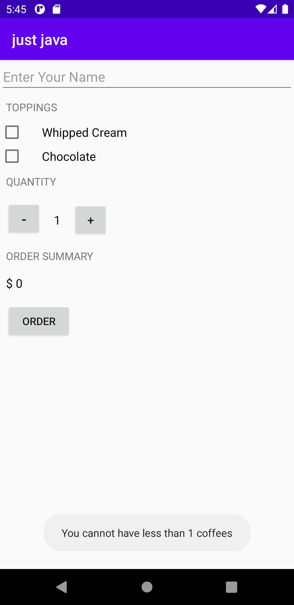

Just Java
===================================

This is a Udacity project to learn how many 

concepts :
----------
- Making the app interactive with the user
- Intents (Sending the order Summary in Email)
- OOP (classes and objects)
- Strings and how to make the app has different language versions

Screenshots:
------------

 